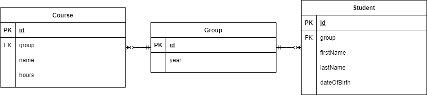
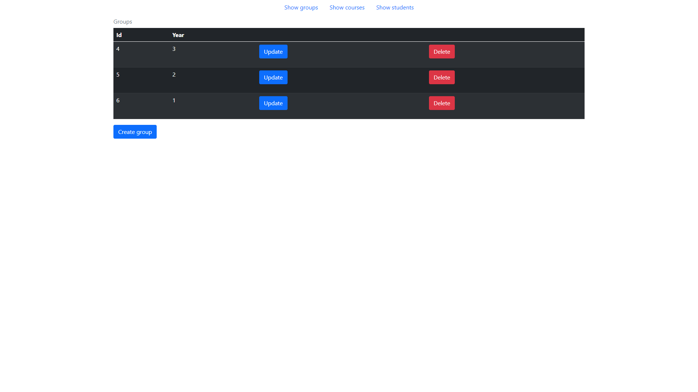
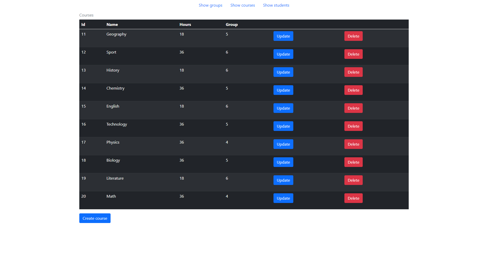
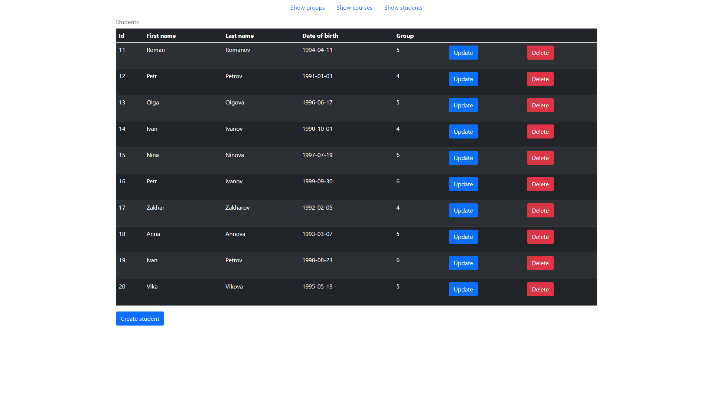
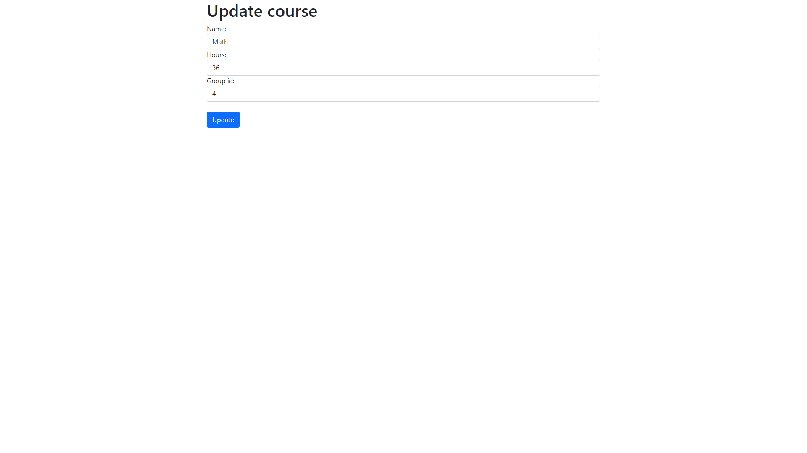
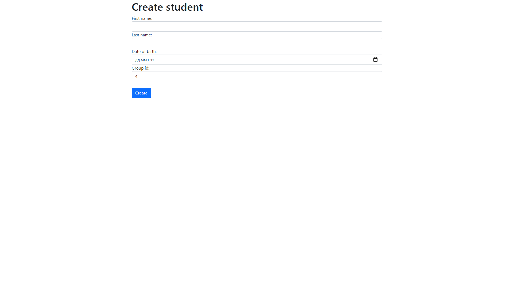
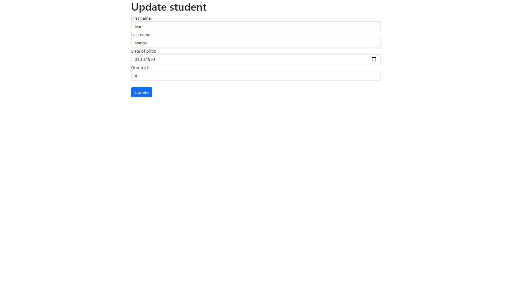

# Practical work #1 for Enterprise Systems Architecture course 
 
- JDK 16.0.2
- Jakarta EE 9.1
- GlassFish 6.2.1
- PostgreSQL 13.3
- Intellij IDEA Ultimate 2021.2.1

## University
### Model and business layer
Servlets, EJB and Hibernate

#### Entity diagram:

#### SQL scripts:
- [drop_create_schema](sql_scripts/drop_create_schema.sql) - drops the tables if they exist and then creates them 
- [insert_data](sql_scripts/insert_data.sql) - inserts data to the created tables
- [delete_data](sql_scripts/delete_data.sql) - deletes all data from the tables

### View
JSP and Bootstrap

#### Screenshots:

